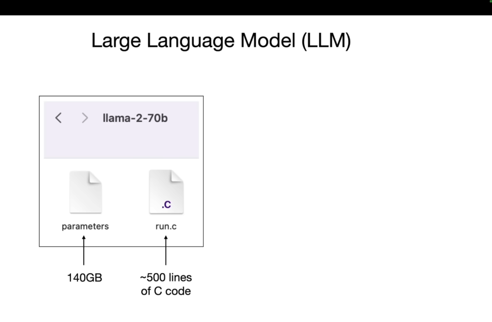
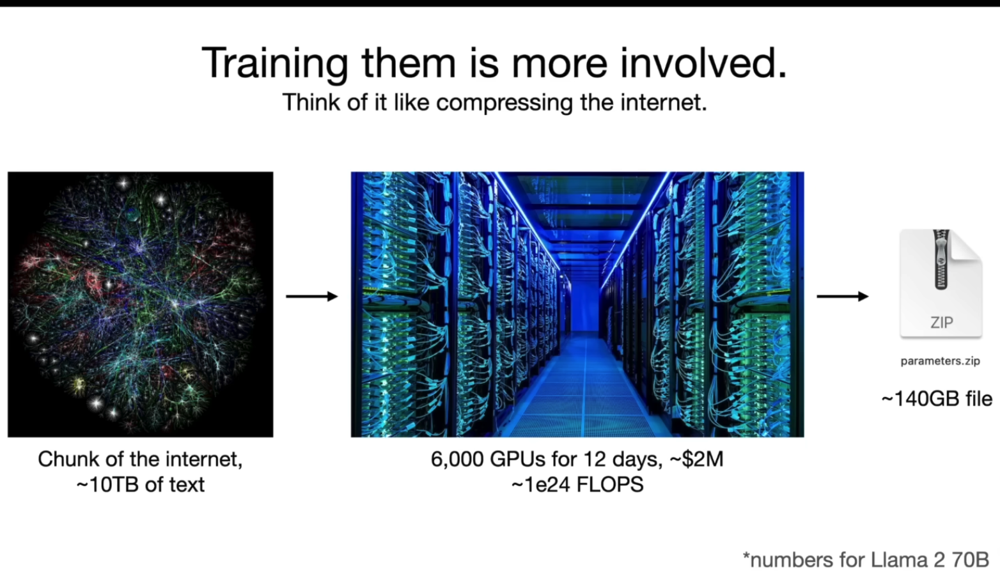
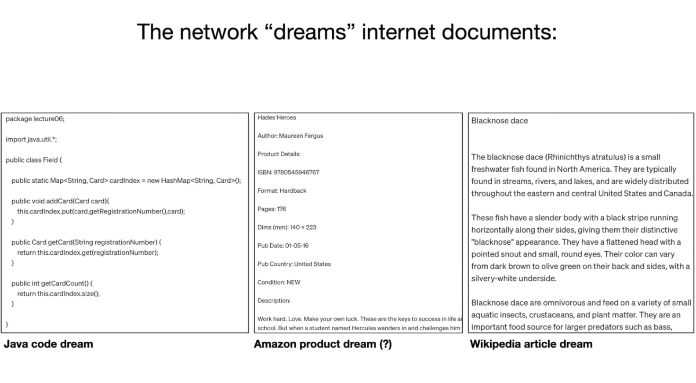
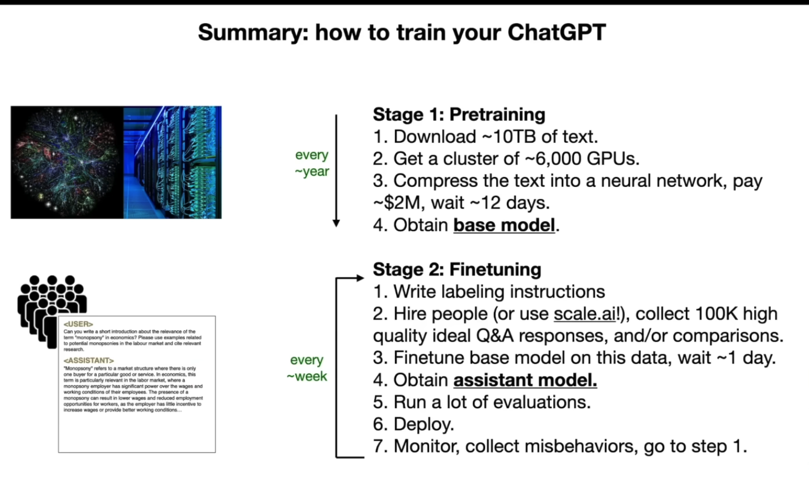

# Intro to LLMs, Platform Design and Data

---

## Goals

Today's lecture: first, reflect on LLM basics video. Then, briefly introduce some ways that platform design choices and norms affect current and future data

## About this lecture

- Goal is to integrate the Intro to LLMs (Karpathy's video + several linked slide decks) with our LLM-data related readings and examples (Pile, RefinedWeb, blog posts on the topic)
- [Video](https://www.youtube.com/watch?v=zjkBMFhNj_g)

---

## See also

- Thom Wolf (HuggingFace), "A little guide to building Large Language Models
in 2024": [link](https://docs.google.com/presentation/d/1IkzESdOwdmwvPxIELYJi8--K3EZ98_cL6c5ZcLKSyVg/edit#slide=id.g2c144c77cfe_0_76)
- Graham Neubig (CMU), "Tour of Modern LLMs (and surrounding topics": [link](https://phontron.com/class/anlp2024/assets/slides/anlp-15-tourofllms.pdf)

---

## Karpathy's "Two files" mental model

- parameters (2 bytes for a float16 per param -> 140 GB for a 70B param model)
- run.c (notes its 500 lines of C code!)

---

---

## A few useful tidbits

- Getting a sense of the file sizes can be useful
- Note the point about 7B being about 10x slower (linear) than 70B

---

## More useful order of magnitude figures

For 140GB 70B params "file":

- 10 TB of text "chunk of the Internet"
- 6,000 GPUs for 12 days, costing about 2M USD (2.7M CAD)
- 1e24 FLOPs. That's 10 to the 24th!

Quick question: What's the compression ratio?

---

---

## Lossy compression

"Gestalt" of the actual knowledge / content

---

## What about prod systems

- About 10x in size (when this video came out!!!)
- 10M or 100M dollars for training run (imagine being the person to enter `train.py`...)

---

## About the predictions

- It's "just" a Neural Network!
- "dream" metaphor. Every output is a "dream"?
- it won't parrot documents? How do we square this with copyright lawsuits?

---

## Transformer architecture

- We know all the math, we can write it down
- But all we do as humans is to adjust the parameters to get better "next word"
- mechanistic interpretability (what are the parts doing?)
- weird one dimensional aspects to "knowledge" (e.g. Mother <> Son)
- hand-waving much of the implementation details for now (see longer 2 hour video, https://www.youtube.com/watch?v=kCc8FmEb1nY&t=57s)

---

## LLM as "empirical artifacts"

- More like social science or physical science than (some fields) of computing science
- Not a lot of theory to explain things yet!

---

---

## Assistant Models

- Just add a new dataset with labeling instructions
- People ask questions and answer them
- There's a bunch of secret troves of documents somewhere of "fake" conversations that look like ChatGPT conversations!
- fine tune on this "assistance dataset", typically
- called RLHF

---

## Timelines

Karpathy gives us the heuristic that pretraining is about once a year and finetuning can be once a week

- recall: 10 TB text, 6000 GPUs costing 2M USD over 12 days
- new info: about 100K high quality "ideal" Q&A responses and comparisons of responses
- finetune might take one day
- (note that various online communities have created finetuned models for various purposes)

---

## Responses vs Candidates

- from labeling perspective, it's quicker to pick between a few options vs. write something from scratch
- finetuning on comparions is implemented a bit differently than 

---

## Using models to label?

- LLM creates a draft and people select from it...
- can do labeling that's more "machine labeled"
- Implications?

---

## Chatbot Arena

- ELO rating
- You can play this today!
- Any problems with this?

---

## More on scaling laws

- We can predict performance based on number of params, amount of text (N for number of params here, D for amount of data)
- We're not in the flat zone yet!
- Next word prediction accuracy is correlated with other texts
- So everyone assumes training on more data or with more params will get better "general capabilities"

---

## Example capabilities

- Example of ChatGPT using web browser, running code, passing query to text-to-image
- How could we build our own search on top of an open LLM. Any ideas?
- Other thoughts on current LLM *product* tool use?

---

Are we at the ceiling/wall? Ilya's 2024 NeurIPS talk: https://www.youtube.com/watch?v=1yvBqasHLZs

---

## System 1 and 2

- "fast and slow"
- metaphor: LLMs only have system 1, no system 2
- How can convert time into accuracy?
- Question: How can you do this right now?

---

## Self-improvement

- Example of Go
- Basic idea: is if you have a simple reward function that says "was the thing good or bad" we can just use that reward
- What are contexts might work here?
- Interesting semi-example: Dota 2

---

## Karpathy's vision of LLM OS

- What did you think about this? 
- Do you want this on your laptop? Your phone? A local cluster in the school library?

---

## "Jailbreaks"

- How to get ChatGPT to tell us how to manufacture napalm through "roleplay"
- Active research area on "jailbreak attacks"
- Role play scenarios, base64 encoding, "universal transferable suffix"
- generally about bypassing system guardrails
- one human's jailbreak is another human's preferred behavior!

---

## Other attacks

- white image with faint text (classic resume hack)
- prompt injection attacks from a web page
- security knowledge will certainly remain relevant in post-LLM world :)

---

## Data poisoning

- "trigger phrase" in a spy movie
- we can do this to LLMs?

---

## A few other perspectives

Thom Wolf's "stages of data training"

- Pretraining -> instruction tuning -> alignment -> in-context learning -> task-specific fine-tuning
- Suggestion: just pull up the [slides](https://docs.google.com/presentation/d/1IkzESdOwdmwvPxIELYJi8--K3EZ98_cL6c5ZcLKSyVg/edit#slide=id.g2c144c77cfe_0_76) here

---

Yi's data cleaning pipeline

- Language filtering -> Text Metric filtering
- -> Repetitive Document Removal -> Rule Based Correction
- -> Perplexity filtering -> Document Quality Filtering 
- -> Paragraph deduplication -> MinHash Deduplication
- -> Exact Deduplication -> Semantic, topic, and safety filtering

(Main point here is just the potential for *many* steps)

---

## Quality filtering with heuristics

- We might want to filter based on... word count, repetition, certain patterns in a document, various ratios (all caps), general descriptive stats
- This involves a lot of design decisions, however! Tough to do in a principled way
- See the full deck for lots of implementation details

---

## Back to the data...

- So we're all on the same page of the high-level overview of how LLMs work

---

## Looking back to 2020

- We had info about GPT-3 training data
- WebText (Reddit links with 3 or more karma), Wikipedia, Books (mystery), Common Crawl
- "there's already voting going on!"

---

## InstructGPT in 2022

- InstructGPT (a precursor of modern ChatGPT model) has a model card with info about scraped data and human labelers
- Similar to 2020
- Also... Twitter was in the training data for some portion of time?

---

## Important note: the role "of high quality filters"

- Blog notes that "so whoever contributed high-quality content to said reference corpora is likely playing an amplified role"
- This can really skew the relative weights of different people
- Critical open research question: system-level data valuation

---

## Pre-training vs. Fine-tuning data

What's the difference between ideal pre-training and fine-tuning data?

---

## Applying it to your interests

- What's the best data source for your need?
- What data do you want avoid?
- For your discussion section: What data do you want to have available in 5 years?

---

# PART 2

---

Key learning goals: 

- How do design choices from the last 1-10 years affect *currently active AI systems*
- How will AI systems affect future platform development?
- How will this affect some of your potential jobs?

---

## A quick note

- We're going to see a lot of example research papers, many from this [repo](https://github.com/nickmvincent/UGCValueRoundup/blob/main/wikipedia.md)
- For 419, you're not expected to memorize any facts about these (they're not assigned reading)
- Wikipedia is just one example -- it's a major player, but think about analogs for other platforms

---

Recall from the Pile

Top 10 sources:
| Component           | Raw Size (GiB) | Weight (%) | Epochs | Effective Size (GiB) | Mean Document Size (KiB) |
|---------------------|-----------------|------------|--------|----------------------|--------------------------|
| Pile-CC             | 227.12          | 18.11      | 1.0    | 227.12               | 4.33                     |
| PubMed Central      | 90.27           | 14.40      | 2.0    | 180.55               | 30.55                    |
| Books3†             | 100.96          | 12.07      | 1.5    | 151.44               | 538.36                   |
| OpenWebText2        | 62.77           | 10.01      | 2.0    | 125.54               | 3.85                     |
| ArXiv               | 56.21           | 8.96       | 2.0    | 112.42               | 46.61                    |

(from https://arxiv.org/pdf/2101.00027, Table 1, Gao et al.)

---

| Component           | Raw Size (GiB) | Weight (%) | Epochs | Effective Size (GiB) | Mean Document Size (KiB) |
|---------------------|-----------------|------------|--------|----------------------|--------------------------|
| Github              | 95.16           | 7.59       | 1.0    | 95.16                | 5.25                     |
| FreeLaw             | 51.15           | 6.12       | 1.5    | 76.73                | 15.06                    |
| Stack Exchange      | 32.20           | 5.13       | 2.0    | 64.39                | 2.16                     |
| USPTO Backgrounds   | 22.90           | 3.65       | 2.0    | 45.81                | 4.08                     |
| PubMed Abstracts    | 19.26           | 3.07       | 2.0    | 38.53                | 1.30                     |

---

The rest:

- Gutenberg (PG-19)
- OpenSubtitles
- Wikipedia (en)
- DM Mathematics
- Ubuntu IRC
- BookCorpus
- EuroParl

HackerNews, YoutubeSubtitles, PhilPapers, NIH ExPorter, Enron Emails

---

"Following Brown et al. (2020), we increase the weights of higher quality compo- nents, with certain high-quality datasets such as Wikipedia being seen up to 3 times (“epochs”)"

"models trained on the Pile have greater cross-domain generalization capabilities without compromising performance on traditional benchmarks"

---

Briefly touch on:

- English data
- topic modeling
- pejorative content?
- gender bias?
- religious bias?

---

Tensions: Author consent, public data

(Note this paper is from Dec 2020 -- and now this is a big topic in UK / AUS politics, may come to NA soon enough)

---

Also important to call out Footnote 16 as we start to intersect with copyright and IP...

"This discussion does not, and is not intended to, constitute legal advice; rather, it is a general discussion of law. Only your attorney can provide assurances that the information contained herein is applicable or appropriate to a particular situation. If in doubt, it is always advisable to speak to an intellectual
property attorney"

Indeed!

---

Note also in this paper they argue for transformative fair use.

Note that this is a non-profit org focused on open source, open access research (very much "pure" public goods.)

---

## Case Study of Wikipedia in particular

- The Role of Wikipedia in early NLP (case study)
- Wikipedia as Training Data
- The general cycle of design <-> modeling

---

# The Role of Wikipedia in early NLP

meals and recipes.

---

## Case Study: How can a Wikipedia article be used?

In two primary "forms"

- as a meal to be served
- as training data

---

## Document as the meal

"What hours does the Purple Line Express run?"

---

## Document as the data

See wikitext

---

## Wikipedia links to provide context

* "YouTube Will Link Directly to Wikipedia to Fight Conspiracy Theories" - Louise Matsakis in Wired, 2018. [Link](https://www.wired.com/story/youtube-will-link-directly-to-wikipedia-to-fight-conspiracies/)
    - Summary: YouTube will use Wikipedia links to provide context on "conspiracy theory videos".

---

* "The Effects of an Informational Intervention on Attention to Anti-Vaccination Content on YouTube" - Sangyeon Kim et al. ICWSM, 2020. [Link](https://ojs.aaai.org//index.php/ICWSM/article/view/7364)
    - Summary: A research study of the effects of YouTube's intervention.

---

* "Facebook outsources its fake news problem to Wikipedia—and an army of human moderators" - Kerry Flynn in Mashable, 2017. [Link](https://mashable.com/2017/10/05/facebook-wikipedia-context-articles-news-feed/)
    - Summary: Facebook is also using Wikipedia links to provde context about entities who publish news content.

---

* "Facebook Adds Wikipedia Knowledge Boxes in Search Results" - Andrew Hutchinson in SocialMediaToday, 2020. [Link](https://www.socialmediatoday.com/news/facebook-adds-wikipedia-knowledge-boxes-in-search-results/579510/)
    - Summary: Facebook adds a search results-esque "Knowledge Panel", drawing on Wikipedia data.

---

## Wikipedia links answer search queries

* "Auditing the Information Quality of News-Related Queries on the Alexa Voice Assistant." - Henry Kudzanai Dambanemuya and Nicholas Diakopoulos in CSCW 2021.  [Link](https://doi.org/10.1145/3449157)
  - Most prevalant source (18.6%)

---

* "Auditing the Personalization and Composition of Politically-Related Search Engine Results Pages" - Ronald E. Robertson, David Lazer, and Christo Wilson in The Web Conference (WWW) 2018. [Link](https://doi.org/10.1145/3178876.3186143)
  - knowledge components often link to Wikipedia

---

## Wikipedia links answer search queries

* "A Deeper Investigation of the Importance of Wikipedia Links to the Success of Search Engines" - Nicholas Vincent and Brent Hecht in CSCW, 2021. [Link](http://www.nickmvincent.com/static/wikiserp_cscw.pdf)
    - Quote: "Our findings reinforce the complementary notions that (1) Wikipedia content and research has major impact outside of the Wikipedia domain and (2) powerful technologies like search engines are highly reliant on free content created by volunteers."

---

## Wikipedia is everywhere on the web!

Examples of studies that study how Wikipedia text is re-used and how Wikipedia links add value to other online platforms.

---

* "Examining Wikipedia with a broader lens: Quantifying the value of Wikipedia's relationships with other large-scale online communities" - Nicholas Vincent, Isaac Johnson, and Brent Hecht in CHI 2018. [Link](https://doi.org/10.1145/3173574.3174140)
  - Wikipedia links generate traffic to Reddit and StackOverflow

---

* "Wikipedia Text Reuse: Within and Without" - Milad Alshomary et al. in ECIR 2019. [Link](https://doi.org/10.1007/978-3-030-15712-8_49)
    - Quote: "We further report on a pilot analysis of the 100 million reuse cases inside, and the 1.6 million reuse cases outside Wikipedia that we discovered. Text reuse inside Wikipedia gives rise to new tasks such as article template induction, fixing quality flaws, or complementing Wikipedia’s ontology. Text reuse outside Wikipedia yields a tangible metric for the emerging field of quantifying Wikipedia’s influence on the web."

---

## Wikipedia articles as documents that answer questions
Question answering involves aspects of both document retrieval ("serve" Wikipedia content) and machine "understanding" of text (e.g. the ability to identifying the portion of a document that answers a question). 

As such, these systems share similarities with both search engines and language models.

---

* "Reading Wikipedia to Answer Open-Domain Questions" - Danqi Chen et al. in ACL 2017. [Link](https://arxiv.org/abs/1704.00051)
    - Quote: "Our approach combines a search component based on bigram hashing and TF-IDF matching with a multi-layer recurrent neural network model trained to detect answers in Wikipedia paragraphs."

---

* RikiNet: Reading Wikipedia Pages for Natural Question Answering - Dayiheng Liu et al. in ACL 2020. [Link](https://www.aclweb.org/anthology/2020.acl-main.604/)
    - Quote: "In this paper, we introduce a new model, called RikiNet, which reads Wikipedia pages for natural question answering... To our best knowledge, it is the first single model that outperforms the single human performance."

---

# Wikipedia as Training Data ("Wikipedia as a Recipe")

---

## Wikipedia text as training data
* "KELM: Integrating Knowledge Graphs with Language Model Pre-training Corpora" - Siamak Shakeri et al. in NAACL 2021. [Link](https://ai.googleblog.com/2021/05/kelm-integrating-knowledge-graphs-with.html)
    - Uses "a large training corpus of heuristically aligned Wikipedia text and Wikidata KG triples"

---

* "Language Models are Few-Shot Learners" - Tom B. Brown et al in arXiv, 2020. [Link](https://arxiv.org/abs/2005.14165)
    - Summary: Wikipedia is one of the "high-quality" text data sources for training the massively high-profile language model "GPT-3".

---

* "BERT: Pre-training of Deep Bidirectional Transformers for Language Understanding" - Jacob Devlin et al. in NAACL 2019. [Link](https://www.aclweb.org/anthology/N19-1423/)
    - Quote: "for the pre-training corpus we use the BooksCorpus (800M  words) (Zhu  et  al.,2015) and English Wikipedia (2,500M  words)"
    - Note: This is an enormously influential paper, with over 19,000 citatons as of May 2021.

--- 

* "Censorship of Online Encyclopedias: Implications for NLP Models" - Eddie Yang and Margaret E. Roberts in ACM FAccT, 2021. [Link](https://doi.org/10.1145/3442188.3445916)
    - Summary: Examines in the impact of Wikipedia on NLP models by comparing models trained with and without Wikipedia.
    - Quote: "We show that word embeddings trained on Baidu Baike, an online Chinese encyclopedia, have very different associations between adjectives and a range of concepts about democracy, freedom, collective action, equality, and people and historical events in China than its regularly blocked but uncensored counterpart - Chinese language Wikipedia"

---

* "Microsoft Word is getting politically correct" - Mark Sullivan in Fast Company, 2019. [Link](https://www.fastcompany.com/90346224/microsoft-word-is-getting-politically-correct)
    - Quote: "For the various new checks, Microsoft assembled a team of linguists and other experts to anticipate the poor word choices people might make, and assemble lists of terms that would work better... The AI’s training data also includes Wikipedia pages, which are constantly being updated and corrected."^[Notable in light of faction mad about Wikipedia's politics...]

---

* "WikiBrain: Democratizing computation on Wikipedia" - Shilad Sen et al. in OpenSym 2014. [Link](https://doi.org/10.1145/2641580.2641615)
    - Summary: Includes a variety of examples of Wikipedia-dependent computational models.
    - Quote: "Our work, and literally hundreds of NLP, AI, and IR algorithms would not have been possible without the billions of words of knowledge you encoded within Wikipedia."

---

## Wikipedia in the training pipeline

Sometimes Wikipedia "sneaks into" the training pipeline

* "ImageNet Large Scale Visual Recognition Challenge" - Russakoksky et al. in International Journal of Computer Vision, 2015. [Link](https://doi.org/10.1007/s11263-015-0816-y)
  - MAJOR influence on computer vision for the past 9 years.

---

## Quote from the ImageNet paper

"To collect a highly accurate dataset, we rely on humans to verify each candidate image collected in the previous step for a given synset. This is achieved by using Amazon Mechanical Turk (AMT)... In each of our labeling tasks, we present the users with a set of candidate images and the definition of the target synset (*including a link to Wikipedia*). We then ask the users to verify whether each image contains objects of the synset. We encourage users to select images regardless of occlusions, number of objects and clutter in the scene to ensure diversity."

---

## Wikipedia in the training pipeline

* "Improving Medical Code Prediction from Clinical Text via Incorporating Online Knowledge Sources" - Tian Bai and Slobodan Vucetic in The Web Conference (WWW), 2019. [Link](https://doi.org/10.1145/3308558.3313485)
    - Summary: Wikipedia helps assign medical codes to clinical notes.
    - Quote: "The main idea of KSI is to calculate matching scores between a clinical note and disease related Wikipedia documents, and combine the scores with output of the baseline model."

---

## The Role of Wikipedia in modern NLP

- See the [Wikitext dataset on HuggingFace](https://huggingface.co/datasets/wikitext)
  - 897k downloads as of Mar 19, 2024

---

Data Provenance:

## Who makes the rules on Wikipedia?

- Turns out there's a lot of literature on this! 

---

## Why Use Wikipedia?

From [Merity et al. 2016](https://arxiv.org/abs/1609.07843)

"We selected articles only fitting the Good or Featured article criteria specified by editors on Wikipedia. These articles have been reviewed by humans and are considered well written, factually accurate, broad in coverage, neutral in point of view, and stable. This resulted in 23,805 Good articles and 4,790 Featured articles. The text for each article was extracted using the Wikipedia API. Extracting the raw text from Wikipedia mark-up is nontrivial due to the large number of macros in use."

---

From GPT-2 paper:

- Section 2.1 (Training dataset): "Most prior work trained language models on a single domain of text, such as news articles (Jozefowicz et al., 2016), Wikipedia (Merity et al., 2016), or fiction books (Kiros et al., 2015)."

---

- Section 5 (RW): "More inspirational to our work was the observation of [Liu et al. 2018](https://arxiv.org/abs/1801.10198) that a model trained to generate Wikipedia articles also learned to translate names between languages."

---

# Design <> Modeling

- The AI/ML community selected on Wikipedia because of the Wikipedia design principles / norms
- But thus we're subject to potentially surprising governance dependencies 

Example: what exactly is a "Good" article

---

This is important because it means that the impact of design isn't a *huge shock* to the ML community. Rather, there's just a point of disconnect here.

It's not that this massive dependency on Wikipedia is *bad*, we just have to do more to account for it!

---

## Compare with Reddit

How *exactly* is downvoting implementing?

How do subreddit-specific norms affect this?

---

## Design influencing data

- Each button design, how actions are described and communicated...
- All these things affected what went into GPT-2 (which shaped a LOT of future capital allocation)
- What designs right now will affect GPT-10? The TikTok scroll pattern? Swiping left/right?

---

## Other platforms

- Review platforms
  - Implications of 5-stars for everything nowadays?
- Even things like course feedback and other student surveys
- What else can you think of?

---

## Big category that's relevant to us: Code and Q&A

- GitHub
- StackExchange

---

## Factors we might consider

- Extent of user-driven rules and design
  - Very user driven (Wikipedia) <-----> All corporate (workplace issue filing system)
- Where is information binarized or categorized

---

## Impact on your work

- Knowing about these factors can be an advantage in domain-specific modeling (e.g. if you want to do ML at Reddit)
- Lens to understand AI capabilities

---

## Beyond platforms with "volunteer data contribution"

- What about data that's clearly owned by an organization?
- What about data that's created by workers as part of their job?
- That's our next topic!

---

# Data Governance

Note: rather than screenshot most of the paper, we'll pull up our readings directly for much of this lecture. This may make for a worse "reading the PDF version" experience, my apologies!

[link](https://dl.acm.org/doi/abs/10.1145/3531146.3534637)

---

## Goals

Today's lecture: gain exposure to a few different frameworks for data governance.

Some guiding questions (to keep back of mind)

- How are data governance decisions being made now?
- What kind of interaction with "governance" will you have in the future? As a voter, as a modeler, as a data creator, etc.

---

## Recap: What is governance

From: [WP](https://en.wikipedia.org/wiki/Governance) 

> "Governance is the process of making and enforcing decisions within an organization or society. It encompasses decision-making, rule-setting, and enforcement mechanisms to guide the functioning of an organization or society." 

From the Commission on Global Governance:

> "the sum of the many ways individuals and institutions, public and private, manage their common affairs"" 

Pick your favorite LLM and get an answer like this

---

## C.f. Global Climate Governance

Can be useful to think about data governance as a paralell to climate governance. 

What are the current processes in place to determine how new climate laws are passed, how they're enforced, how they do (or do not) cascade between states

---

Latin for "confer or conferatur", meaning "compare" in English. Abbreviation used for "compare with" [WP](https://en.wikipedia.org/wiki/Cf.)

---

## What's NOT governance...

- Things that happen in nature, outside the scope of an organization... maybe
- You can make a really strong argument for much of the physical and social world being part of, or subject to, some governance process though

Exact categorization of governance or not is not a big deal for our immediate concerns, but the point here is to emphasize the flexibility of the word (and the value of frameworks)

---

## Outline

- The LLM model from Jernite et al. (with a big et al.!)
- CARE principles and indigenous data governance
- (if time) intro to some other perspectives

---

# Data Governance for LLMs

---

## How has Data Governance been affected by the LLM era

Key differences of the LLM era are even more 

- "generality"
- scale

Jernite et al., Section 1: 
> "Wikipedia-scale corpora to close to three orders of magnitude more"

---

## What does it mean to design a new governance structure?

Note: "design a new governance structure" = change the rules or norms (implicitly, it's about policy change and changing implicit rules)

It's ambitious!

---

## The "DSO"

Key idea of this paper is a "Data Stewardship Organization" -- a new org that would act as a facilitator (e.g., talk to data creators and data subjects, but also talk to modelers and legal teams and such)

Another key idea: laws vs tools

---

## Important concerns from the paper to flag

- ML community values performance (Birhane et al., citation 18)
- role of European regulatory drive
- how to share benefits equitably?
- issues with human rights framing (many conflicting documents)
- Critical perspectives: human rights and decoloniality

---

## Specifity of data governance

This paper really focuses on language data, with a call out for human-centric data.

How might other modalities disrupt this proposal?

---

## Another Lifecycle of Data

1. Creation
2. Selection
3. Documentation
4. Dissemination
5. Hosting

--- 

6. Serving
7. Conservation
8. Tracking
9. Versioning
10. Deletion

---

## Actors involved

---

## Different kinds of work (different kinds of rules)

- Work done with data vs. work done around data access/control
- My interpretation: stuff you do once you've loaded `data.csv` or `data.parquet` vs. stuff you do that will get you a different `data.csv`

---

## Contestation

- Important to note that incorporating contestation into data governance framework has the potential to really impact your day to day
- Decent chance you might have to re-do your modeling or analysis as an employee

"actionable guidelines and processes for identifying what consitutes a legitimate
removal request depending on the local norms and regulations of
the requester and data custodian"

---

## Infrastructure for contestation

Note that if you leave `data.csv` on your work machine for all eternity, this breaks contestation! So you need to either have some kind of periodic (weekly?) check-in ritual to see which rows need to be deleted, or you can't actually leave data on your machine and have to "pull" it at training time

---

# Language data specific considerations

---

## Issues with "Clean Text"

- Idea that some procedure will give you "unbiased" text
- "Noisy social media" vs. "Clean Prestige Text"

See e.g. Anjalie Field, Su Lin Blodgett, Zeerak Waseem, and Yulia Tsvetkov. 2021. A
Survey of Race, Racism, and Anti-Racism in NLP. arXiv:2106.11410 [cs.CL] 

---

## Discussion questions

- How should do you think we should balance training data representation concerns?
- How do we account for the incentives in a product context, where our boss might want our system to be biased towards language or linguistic patterns of a certain market segment?

---

## Property rights and privacy rights

- Data governance framework must account for many definitions of property rights (what does a particularl government say about your right to profit from a piece of artwork, your right to remove it from circulation, etc.)
- Property rights are distinct from privacy rights (require a definition of personal data, typically)

---

## User rights as well?

- Users of models have "user rights" in some jurisdictions as well
- e.g. civil rights in the U.S. context might guarantee non-discrimination from models offered by certain actors (e.g. LLM used in the employment or education context)

(Lots of open questions here, keep an eye on this space.)

---

## This seems like a lot of uncertainty!

- A lot of these points have major caveats like "it depends on jurisdiction" or "courts might decide to enforce a particular interpretation of a particular right"
- This means doing innovative work in this space requires navigating these stormy waters, a bit
- E.g. you might have to hire some folks to handle cross-border user property rights, privacy rights, or user rights if you're building a model in a high-stakes domain

---

## One thing that the ML community can do to help: Dataset documentation

- The Jernite et al. paper also includes a major call for documentation
- Note some potentially really serious issues that have been caught before, e.g. misogyny and very controversial content in computer vision datasets (Birhane et al. ref [19])

---

If you're going into ML research, learning dataset documentation practices may give you a leg up as they become more commonly required in paper submissions.

---

## Existing data management "efforts"

- Centralized (e.g. GitHub, Microsoft Research website)
- Public (e.g. UCI ML, HuggingFace -- things we've used in class

> "Our values of autonomy, consent, and contestation are difficult if not practically impossible for public dataset repositories, due to the full reliance on self-governance by dataset submitters"

---

## Wikimedia as a case study

Wikipedia has a complex governance structure that "works" right now

- rights holders 
- custodians (Wikipedia editors)
- steward (WMF)
- data users / modelers (researchers, e.g.  perhaps you as a student in ML!)

Potential conflicts between values. Many different languages and geographies.

---

## OK, so what should we do?

There's a lot of concepts to unpack here. How should we change our behavior going forward? Assuming we agree with all this, what should we do? If we don't agree with this, what should we do?

---

## Actors

Define 6 actors (they can overlap; you can both host data and use it to train models!)

---

## Data Rights-holders

- either a subject or a creator
- can contest, give consent, express privacy concerns, ask for attribution, ask for just rewards

Example: you put your code on GitHub

---

## Data providers

- organization to aggregates the data

Example: HuggingFace includes your code on Github in "The Stack" based on it's license (and gives you an opt-out option)

---

## Data hosts

- Organization that specifically hosts the data; might be the same as the provider

Example: HuggingFace hosts that data. Perhaps an additional research org, like a lab at a university, also hosts a copy.

---

## Data Modeler

- Organization that does some training!

Example: you train a large language model on a aggregated code data.

---

## Data Stewardship Organization (DSO) and Data helpers

- Organization that facilitates communication between all other actors
- Helpers might be e.g. lawyers who provide advising

Example: This is the org that needs to be brought into existence!

---

## Contractual flow-down

*In this framework*, there's a requirement that:

> "each subsequent actor on this path is responsible for communicating the requirements and restrictions formulated by its predecessors in addition to its own" (Jernite et al., Section 5)

This is part of the proposal: some actors might argue *this isn't currently part of the rules*

---

## Discussion question

- Who stands to gain from contractual flow-down?

---

# CARE principles

[link](https://www.adalovelaceinstitute.org/blog/care-principles-operationalising-indigenous-data-governance/)

---

CARE = 

- collective benefit
- authority to control
- responsibility
- ethics

---

## Practice of developing new principles

- Workshop event in 2018
- people come together and draft new set of goals / principles
- drawing on principles from various Data Sovereigny groups (First Nations, Maori, U.S., Torres Strait)

---

## What is "Indigenous data sovereignty"

[link](https://www.lib.sfu.ca/help/publish/research-data-management/indigenous-data-sovereignty)

> "Indigenous data sovereignty means that Indigenous Peoples have the right to own, control, access, and steward data about their communities, lands, and culture"

- Note this a key aspect of Canadian research ethics
- Take a look at above link to learn more about specific examples

---

## Data-centric vs. people-centric

the CARE principles are meant to avoid excessively "Data-centric" approach, and be more people and purpose-driven

Example: Collective Benefit is about the ultimate purpose of the data, not selecting a certain observation from a given data file on the basis of some ML peformance metric

---

## Context: CARE in the previous piece vs. prevailing practice

- Important to note that after having read the Jernite et al. piece, these "people-centric" principles were certainly a part of it. 
- The real contrast here is the current system

---

# Big list of concepts to reflect on

- Values in the ML community
- Lifecycle of data
- Difference between working on a dataset vs. working to get a dataset
- Lifecycle of data

---

- Contestation
- Language discrimination and problematic notions of "clean" data
- Property rights
- Privacy rights

---

- contractual flow-down
- Indigenous data sovereignty
- CARE principles

## Other perspectives

- "Relational theory" from Viljoen [link](https://heinonline.org/hol-cgi-bin/get_pdf.cgi?handle=hein.journals/ylr131&section=12)

---

---
theme: eloc
background: none
class: text-center
highlighter: shiki
lineNumbers: false
drawings:
  persist: false
transition: slide-left
title: Week 13
mdc: true
author: Prof. Nick Vincent
institute: Simon Fraser University
date: 
---

# Perspectives on Data Markets

---

## Guiding questions

- When are data markets good?
- If data is mostly obtained via markets, do we all need to learn market economics?
- When should we work on systems that are "markets"?
- How should vote or otherwise participate in the governance of market regulations.

---

## Philosophical question

*What's a market to you?*

Question to return to: how might we code a market.

---

## Against individual markets

First paper: 

"Why paying individual people for their health data is a bad idea" - Prainsack and Forgó, 2022

This is a Nature Medicine "comment". Basically, a high-profile op-ed.

---

## Arguments against markets (for health data)

- power asymmetry between subjects + data modelers ("one-way mirror")
- both individual and systemic harms
- exacerbate inequalities 

---

## inequalities in remuneration

- higher income countries get paid more for data
- dependence on data income

---

## data quality issues

- selection bias
- data falsification ("yes, I definitely have that very rare disease...")

---

## Health data as collective property

- individual rights in the context of privacy and consent
- community level decision making
- some tension with open access!

Reflection question: What's health data?

---

## Counterpoints

- Perhaps we should share data to improve patient care, and this might involve markets?
- How much tension is there, really?

---

# Data Sharing Markets: System and Mechanism Design Perspective

Lots of details in the SIGMOD paper -- please peruse based on interests. We won't cover these for the sake of this class.

---

## Acemoglu et al., Too Much Data

> "When a user shares her data with online platforms, she reveals information about others. In such a setting, externalities depress the price of data because once a user's information is leaked by others, she has less reason to protect her data and privacy. These depressed prices lead to excessive data sharing."

See^[https://www.aeaweb.org/articles?id=10.1257/mic.20200200, Acemoglu, Daron, Ali Makhdoumi, Azarakhsh Malekian, and Asu Ozdaglar. 2022. "Too Much Data: Prices and Inefficiencies in Data Markets." American Economic Journal: Microeconomics, 14 (4): 218-56. ]

---

> "We characterize conditions under which shutting down data markets improves welfare. Platform competition does not redress the problem of excessively low data prices and too much data sharing and may further reduce welfare. We propose a scheme based on mediated data sharing that improves efficiency."

## In other words

- Your data sharing choices might affect me
- If you already shared, say, revealing that I'm in this room at 4:30p on Wed., I might share that some info for very low amount
- might need some kind of tax to create better equilibrium

---

## Key goals for 419

- Be aware of these sometimes-competing perspectives
- Be vaguely aware of framing and methods difference between e.g. a Nature editorial, SIGMOD paper, and AEA paper
- Be able to trace the basic arguments, and explain them at a basic level

---

## Example questions

- What are some arguments against individual participation in health care data markets?
- What are some considerations in designing a data sharing market?
- Wbat are some implications of externalities in the context of data sharing?

---

## Additional perspectives for final week

- Data feminism
- Data colonialism

These perspectives may provide arguments for challenging, or changing, certain markets and systems. Again: this is just one of up to 5 (?) courses you may be taking, so the goal is to become aware of these perspectives. Some future classes provide further exploration!

---

## ABMs for structured speculation

Using code (and LLMs, if you like) to explore some of these concepts in a hands on manner

---