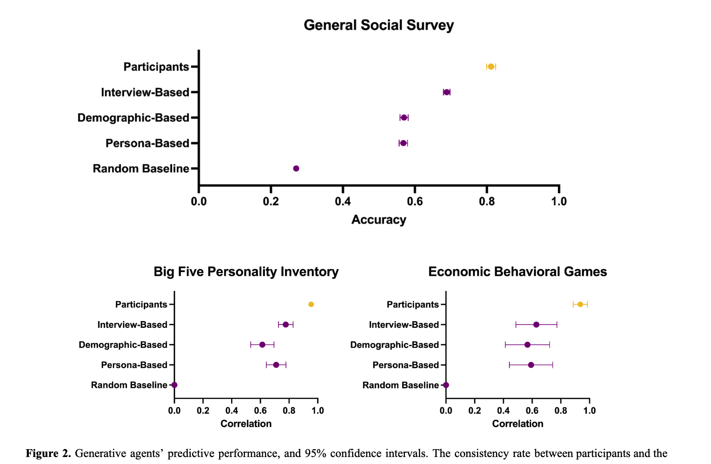
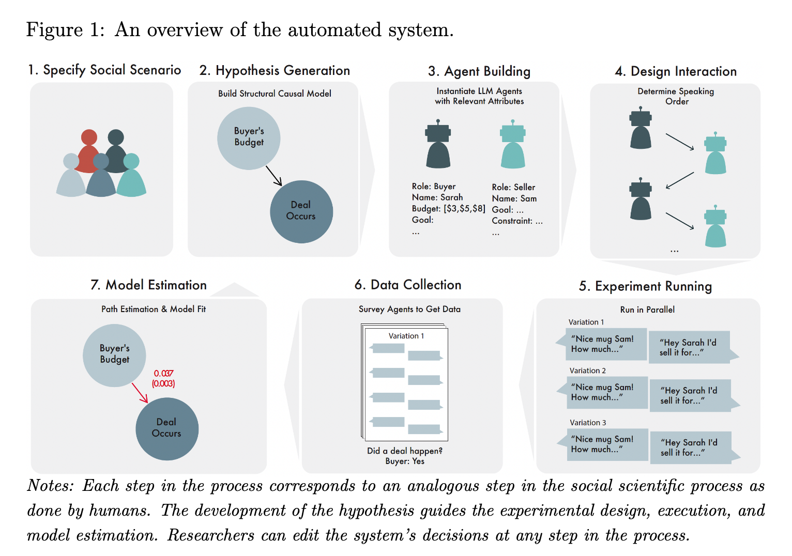

<!-- _class: lead -->

# A Data Flow Perspective on "AI Social Simulation"

**Will Recent AI Advances Enable New Social Science, Destroy Ecosystems for Knowledge, or Something More Subdued?**

---

<!-- _class: lead -->

## Outline

**Total Time: ~45 minutes**

1. Introduction & Key Arguments (5 min)
2. AI's Data Dependence & Background Work (10 min)
3. Problems with Current LLM Social Sim (12 min)
4. A Framework for Better Simulation (10 min)
5. Discussion & Questions (8 min)

---

## Three Key Goals

**#1 - Share A Prediction:**
The overall impact of AI/LLM Social Simulation will fall somewhere between the extremes:
- Not a golden age of social scientific discovery
- Not complete destruction of epistemic communities
- Something more subdued in the middle

(And I home hopeful we can impact this.)

---

## Three Key Takeaways

**#2 - Make A Policy Argument (try to convince you of something):**
Social science should advocate for LLM training data transparency on **purely epistemic grounds**

Improve transparency at three pipeline points:
- Dataset selection
- Mechanistic interpretability
- AI auditing

---

There's lots of other reasons to wade into AI transparency and governance discussions. One of them is -- it's crucial to using these tools for serious social science!

**Three concrete paths to achieve this:**
- Convince all our friends at tech companies!
- Convince regulators
- Convince bodies interested in transparency (public bodies) to build and deploy models
  - See e.g. Apertus, recentSwiss model

---

I'm hopeful this talk (and future iterations) can get more people excited about arguing for transparency around data.

Note: scientific/scholarly communities are themselves likely to be high-leverage groups for bargaining with tech companies (our papers provide "high quality tokens", universities train future tech employees, lots of back-and-forth between academia and industry even now).

---

## Wait, what is AI Social Simulation?

From HCI / Social Computing:

Park et al 2023 - "Generative Agents: Interactive Simulacra of Human Behavior"
https://arxiv.org/abs/2304.03442

"computational software agents that simulate believable human behavior"

---

---

Park et al 2024 - "Generative Agent Simulations of 1,000 People"
https://arxiv.org/abs/2411.10109

"The promise of human behavioral simulation--general-purpose computational agents that replicate human behavior across domains--could enable broad applications in policymaking and social science."

---

---

From management / organization social science perspective:

Manning et al 2024 - "Automated Social Science: Language Models as Scientist and Subjects"
https://arxiv.org/abs/2404.11794

"When given its proposed structural causal model for each scenario, the LLM is good at predicting the signs of estimated effects, but it cannot reliably predict the magnitudes of those estimates"

---

---

## AI's Fundamental Difference from Other Technologies (including methods innovations)

Current AI products are massively **data-dependent**

This makes them different from other technological advances:
- True collective dependence -- there are very many people who made contributions (though individually, each contribution, is small)
- Many counterfactuals where behavior changes make AI worse

---

## Quick Primer: How Content Becomes Model Behavior

**The training pipeline:**
1. Data collection: Your Wikipedia edit, arXiv paper, tweet, Bluesky post gets scraped
2. Dataset curation: Included in training corpus (e.g., Common Crawl, The Pile)
3. Training: Text used to update model weights via gradient descent
4. Inference: Model weights shape how LLM responds to prompts

---

**Key insight:** Individual contributions are small, but:
- Collectively determine what the model "knows"
- Specific domains/communities can have outsized influence
- But we can't trace backward from outputs to data sources

---

## There is strong reason to believe the LLM paradigm is useful for social knowledge

But importantly, if we think an LLM placed into some kind of social/economic simulation might tell us about how real people might respond -- that is possible! It is possible that a model responds a certain way because of collective behaviour ensconced in data records and now model weights.

---

## Thought Experiments

Imagine worlds without:
- Wikipedia
- People using thumbs up in ChatGPT
- People posting on Facebook

**These actions matter for AI systems**

(Impact does require either organization of very impactful contributors, e.g. get all the experts in one area, or *very large action*, e.g. >10% of all non-lurking Internet users)

---

## My Research Agenda

Three interconnected areas exploring data dependence:

1. **Data Leverage & Collective Bargaining**
2. **Public AI**
3. **Content Ecosystem**

---

## Data Leverage

AI depends on data, so we can threaten to withhold, modify, or redirect

Enables data creators to negotiate:
- Small groups with high-leverage specialist data
- Large groups of general users

**Recent work:** CBI position paper @ NeurIPS [V25]
**Older work:** Data leverage foundations [V23]

---

We (computing, computational social science) should support collective action around data so communities can wield "data leverage"

**Note:** Data leverage can be broadly applied to many causes, including those I don't personally agree with

Technical aspects of the work involve data poisoning, scaling, attribution, etc.

---

## Data Leverage and Bluesky / AT Proto (new blogging, source control, etc.)

**Connection to Bluesky:** Keen to connect with Bluesky folks - great discussion at FAccT this year about atproto and these topics

---

## Public AI

We should get public bodies to deploy AI

Disadvantages to be sure ("governments can never compete with Big Tech!"), but they're well-suited because:
- More likely to deploy transparent/open models
- Governed by public consortia (national AI institutes, universities)

**See:** publicai.network, publicai.co, https://arxiv.org/abs/2507.09296

---

## Content Ecosystem Protection

**The hypothesis:**
1. AI substitutes for Wikipedia/Stack Overflow/etc.
2. People stop visiting these platforms
3. Volunteer energy "dries up"
4. New AI models get worse (Wikipedia not updated)
5. Feedback loop wipes out communities

**Shout out:** CDSC work on ecology of online communities (Mako, Nate, Jeremy, Sohyeon, and current students I'll chat with after!)

---

## Related Work: Jailbreaks Study

"An Audit and Analysis of LLM-Assisted Health Misinformation Jailbreaks Against LLMs"
- Ayana Hussain, Patrick Zhao

**Key puzzle:**
LLMs can be very good at:
- Generating jailbreaks against other LLMs
- Detecting these very same jailbreaks

How can this all be true at once?

---

## Data Leverage & Collective Bargaining for Information

**Personal interest area:** Collective bargaining for information to:
- Cushion economic shocks from automation of knowledge work
- Prevent concentration of power by winners in the AI Race

---

**Related work:**
- Empirical and simulation work studying specific instances of collective action
- How much can group X impact AI model Y in terms of performance metric Z?
- Whole workshop at NeurIPS this year on this!

---

## The Promise and Problem of LLM Social Simulation

Why it could be very good:
- Lots of true causal knowledge about social interaction embedded in weights
- Drawing on massive amounts of real human data

---

**The fundamental problem:**
- Can't trace the mechanism of that human data
- Which domains had biggest influence on weights?
- Which subcommunities shaped the model?
- **We cannot figure out the data lineage**

---

<!-- _class: lead -->

## Part 2: Problems with LLM Social Simulation

---

## Problem 1: Stuck Proving "Can" Not "How"

Current state: most work proves LLMs *can* produce phenomena

**Not:** studying how behavior is produced or how it changes with interventions

Many papers ask: "Can LLM agent simulation produce this behavior?"
Instead of: "How does this behavior arise and change?"

---

## Believability != Understanding

Larooij et al. survey found:
- Most metrics focus on "believability" as evaluation
- Human or LLM as judge

https://arxiv.org/abs/2504.03274

---

In simulation literature: **"dynamical sufficiency"** = how well simulation captures dynamics of target phenomenon

Consider: accurately plotting a curve without necessarily understanding the underlying mechanism

LLMs seemed to move us up the dynamical sufficiency scale (larger action space)

---

## Problem 2: Phenomenal vs. Mechanistic Models

**To know "how" a phenomenon arises:**
Mechanists argue we must map model components and activities to hypothesized "real" components

**Phenomenal model:** only concerned with whether behavior is produced accurately

---

## The Intervention Problem

For practical social simulation, we want to test interventions in **unknown counterfactual scenarios**

**The gap:**
- Papers evaluate using sufficiency/believability
- Then test interventions *as if* there are plausible mechanisms

This is related to mechanisms, not just dynamical sufficiency

---

## Problem 3: Can We Use Closed Models?

**Question for the community:**
Can we do LLM sim with closed models accessed by API?

WIP: 35 out of 35 surveyed papers used an API

---

## Threats to Reproducibility

API-based models introduce instability:
- Safety guardrails could alter agent behavior mid-experiment
- Version updates between runs
- Hidden prompt injections
- Safety filters

**The problem is solvable with offline models**
(But... GPU/technical constraints)

---

## The Determinism Problem

Even technical approaches (checking if distributions match) remain "phenomenal"

Mechanisms can be stochastic, but if deterministic:
**LLMs may not be deterministic in practice** even with same seed/temperature

- Thinking Machines work

---

## Defeating Non-Determinism

Work exists on "defeating non-determinism":
- Everything must happen on the same GPU
- Cannot be split up across GPUs
- Then outputs become deterministic

**For API access:** This is not possible
Large providers almost certainly split operations across multiple GPUs

---

<!-- _class: lead -->

## Part 3: A Framework for Better Simulation

---

## Motivation

**Simulation epistemology is confusing**
- Shared pain point across many projects
- Too much historical work on modeling to catch up on

**Goal:** Reduce overhead of needing domain knowledge from philosophy of science

---

Note: this is classical call for this exact kind of seminar: we really need people chatting across departments, our CS grad students to get course credit for going to take an STS course...

---

## The STIE Scale

A scale/axis for measuring **"mechanism plausibility"**

Increases as more parts of the model are falsifiable

To be falsifiable, must have a claim/hypothesis put forward

---

## STIE: Level 0 - S (Simulation)

**Level 0:**
You have a simulation **S** with no operationalized target

---

## STIE: Level 1 - T (Target)

**Level 1:**
Target phenomenon **T** needs to be operationalized to be falsifiable

---

## STIE: Level 2 - I (Intent)

**Level 2:**
**Intent** - Mapping of what mechanisms the components/organization in the simulation represent

---

## STIE: Level 3 - E (Evidence)

**Level 3:**
**Evidence** supports how S, T, I are chosen and operationalized

Can also be falsified/countered

---

## Using the STIE Framework

Each level is a prerequisite for the next

Higher level not strictly better. But!

By evaluating your sim using this framework:
- Easier way to think about background epistemology
- Clarifies epistemic contributions at different levels

---

## Questions

Does this already feel solved?

---

<!-- _class: lead -->

## Summary

---

## Connecting the Dots

Final thoughts on connecting the dots

---

<!-- _class: lead -->

## Discussion

What are your thoughts on:
- Data leverage as a tool for research communities?
- Using closed vs. open models for simulation?
- The STIE framework?

---

<!-- _class: lead -->
